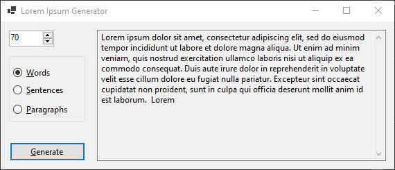

# Lorem Ipsum Generator

**Nível:** 1-Iniciante

Lorem Ipsum é simplesmente um texto fictício da indústria tipográfica e de impressão. 

O objetivo da criação desse projeto é que ele faça parte do portfólio, demonstrando um nível de implementação iniciante.

## 🚀 Começando

Este aplicativo gera passagens de texto *lorem ipsum* adequadas para uso como cópia de espaço reservado em páginas da web, gráficos e muito mais.




É permitido que se escolha entre gerar um certo número de **palavras**, **sentenças** (separadas por vírgulas) ou **parágrafos**.

### 📋 Pré-requisitos

- [.NET](https://dotnet.microsoft.com/pt-br/download)


## ⚙️ Testes unitários

Testes unitários são importantes para garantir cobertura de testes relacionadas as regras de negócios.

Basicamente existem três regras:

- [x] Geração de palavras deve conter o número de palavras solicitado
- [x] Geração de sentenças deve conter o número de sentenças solicitadas
- [x] Geração de parágrafos deve conter o número de parágrafos solicitado


### 🔩 Executando os testes

Para executar os testes unitários:

```
dotnet test LoremIpsumGen\LoremIpsum.Generator.sln --verbosity n
```


## 📦 Implantação

Para executar o exemplo Winforms:
```
dotnet run --project LoremIpsumGen\LoremIpsum.WinForm\LoremIpsum.WinForm.csproj
```


## 🛠️ Construído com

* [Visual Studio](https://visualstudio.microsoft.com/pt-br/) - IDE
* [C#](https://learn.microsoft.com/pt-br/dotnet/csharp/) - Linguagem


## 📄 Licença

Este projeto está sob a licença MIT - veja o arquivo [LICENSE](https://github.com/caiomeletti/lorem-ipsum-generator/blob/main/LICENSE) para detalhes.
